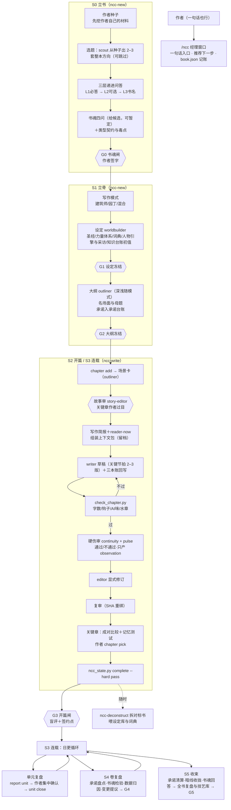

# ncc-workflow — Novel Create Center

ZCode 插件 · v0.4.0 · 个人本地插件

**小说创作中心**：长篇网文从立书到收束的完整工作流。它把长篇网文当作"边写边发、不可撤回、读者每章投票"的活来设计，由两台引擎组成：

- **下限引擎**（不出错、不烂尾）：书魂与类型契约、五层决策、三本账、读者此刻、水章判据、硬伤审、闸门与 SHA。
- **上限引擎**（让作品出彩）：先挖作者自己的种子再给推荐；人物写成有欲望、恐惧、伤口和声音的人；每章先写场景卡、过了故事审才写正文；写手只拿写作简报、看不到审稿清单和书魂原文；关键节拍写 2–3 版由作者挑；评价不打绝对分，关键章用成对比较与读者记忆测试。

**下限靠系统，上限靠作者与选择。** 经理窗口调度十个创作角色，`book.json`＋三本账是唯一状态源，写-审-改三分离；每个需要作者决定的地方都给推荐、理由和备选。

架构说明见 [workflow/architecture.md](workflow/architecture.md)；设计全文（完善计划第七稿与架构审视）在作者的 `~/Documents/grok-files/ncc-workflow/`。

## 流程总览



## 快速开始

```bash
# 在写作项目根目录
/ncc 我想写本书，但只有个模糊的想法          # 一句话入口：经理推荐下一步
/ncc-new 我想写一本都市+诡异+仙侠融合的文    # 开书：档位→方向→问答→书魂→设定→大纲，停在各闸门
/ncc-write 黄金三章                          # 开篇三章：场景卡作者过目、关键节拍多版比选、G3
/ncc                                         # 看状态（含承诺开放/逾期、暂定决策）
/ncc-write 接着写                            # 日更
/ncc 这章卡住了                              # 卡文协议：先查该还哪笔账
/ncc 这个单元写完了                          # 单元复盘：底稿自动生成，集中确认暂定决策
/ncc 准备收尾                                # 收束：承诺清算、暗线收拢、书魂回答
/ncc-review 第12章 打回重写                  # 独立审稿
/ncc-deconstruct ~/Documents/网文拆解/Novels/某书.txt
```

脚本自检（无书也可跑）：

```bash
python3 scripts/test_ncc_state.py                                   # 状态机与机械检查自测
python3 scripts/ncc_state.py init /tmp/t/novels/测试 --title 测试 --level 新手
python3 scripts/ncc_state.py status /tmp/t/novels/测试
python3 scripts/ncc_state.py reader-now /tmp/t/novels/测试 1
python3 scripts/check_chapter.py <书目录> <章号>
```

v0.1 建的书：`python3 scripts/ncc_state.py migrate <书目录>` 升级到 schema 2（原伏笔台账保留）。

## 目录结构

```
ncc-workflow/
  .zcode-plugin/plugin.json     # 插件清单
  workflow/registry.json        # 层/阶段/角色/闸门/三本账/公理/铁律的唯一事实源
  workflow/architecture.md      # 五层决策·三本账·四循环·读者模型·引导层
  commands/                     # /ncc /ncc-new /ncc-write /ncc-review /ncc-deconstruct
  agents/                       # 10 角色：scout worldbuilder outliner story-editor writer
                                #          editor continuity pulse reader deconstructor
  skills/
    ncc/                        # 经理：mind-frame / guidance / craft-canon / loops / finale / sustain / team /
                                #       stage-map / book-state / context-pack；模板含作者种子
    ncc-new/                    # 立书与立骨：qa-layers / book-soul / character / worldbuilding / outline
    ncc-write/                  # 写章：scene-card / writing-brief / chapter-loop / golden-three
    ncc-review/                 # 审稿：review-domains（三层评价细则+报告模板）
    ncc-deconstruct/            # 拆书：对接《小说拆分总纲 5.0》
  scripts/
    ncc_state.py                # 状态机：书/闸门/写作模式/场景卡/章节与比选/三本账/读者此刻/
                                #         单元与卷/复盘底稿/收束/读者数据/存稿/团队与操作日志/迁移
    check_chapter.py            # 章节机械检查（汉字数/钩子/AI味分级与放行/水章/句长起伏参考）
    test_ncc_state.py           # 自测
  docs/usage.md                 # 使用指南
  ACKNOWLEDGMENTS.md            # 设计出处与许可说明
```

书项目结构见 [skills/ncc/references/book-state.md](skills/ncc/references/book-state.md)。

## 核心机制

| 机制 | 说明 | 出处 |
|---|---|---|
| 书魂与类型契约 | 立书先答四问（主题之问、主角的答案、世界的不公、终局），可暂定；主契约＋毒点＋签约点 | 本插件（完善计划第五、六稿） |
| 五层决策 | 书魂→骨架→单元→章→文字，按可逆度分层；下层只能提变更提议 | 本插件 |
| 三本账 | 承诺账（欠读者什么）、知情账（谁知道什么）、世界账（状态事件＋知识台账） | Openwrite 伏笔义务 ＋ oh-story 作者真相/读者已知 ＋ 本插件 |
| 水章判据 | 一章既没建立、推进也没兑现任何承诺 → 机械检查不过 | 本插件 |
| 读者此刻 | 每章上下文包带信息差、在等的承诺、情绪位置、可能腻了什么 | 本插件 |
| 引导层 | 一次一问、推荐置顶、给备选、可暂定、按经验分档、一句话入口 | superpowers ＋ spec-kit ＋ AI-Novel-Writing-Assistant ＋ oh-story ＋ chinese-novelist-skill ＋ BMAD |
| 经理窗口＋角色帽 | `/ncc` 只做意图分类、派单、记账；具体工作派给 9 个专职子代理 | sdlc-workflow |
| book.json 单一状态源 | 状态只由脚本写入；MD 投影永不回写状态 | chinese-novelist-skill ＋ InkOS |
| 上下文包契约 | 无包不写：章纲＋读者此刻＋承诺义务＋人物卡＋意图＋前章结尾＋文风锚 | Openwrite ＋ InkOS ＋ chinese-novelist-skill |
| 三层评价 | 硬伤层通过／不通过（带正文引用）；故事层在正文之前审场景卡；品质层只在关键章做成对比较与读者记忆测试，不打绝对分 | Openwrite 证据锚点 ＋ D13 ＋ TTCW 等研究 |
| 作者种子 | 开书先挖作者自己的画面、执念与经历；推荐标明源自哪条种子 | 本插件（对治同质化，Doshi & Hauser 2024） |
| 人物引擎 | 欲望、需要、恐惧、伤口、信错的那句话、矛盾、秘密、声音；角色采访；主角弧光 | Weiland ＋ 本插件 |
| 场景卡与故事审 | 每章 1–3 张场景卡（翻转、两难、目标情感、画面、风险升级），过故事审才写正文 | 麦基 ＋ Swain ＋ oh-story ＋ 本插件 |
| 写作简报与质检清单分离 | 写手只拿简报；审稿清单、分数阈值、书魂原文不进写手上下文 | 本插件（对治应试写作） |
| 发散—收敛 | 关键节拍写 2–3 版，成对比较后由作者选定 | 本插件 |
| 写作模式 | 建筑师／园丁／混合，大纲闸按模式检查 | 本插件 |
| 四循环与收束 | 单元、卷复盘由台账生成底稿，作者集中确认暂定决策；收束按清单清算承诺、收拢暗线；完本后写跨书技艺库 | 本插件 |
| 读者数据回流 | 真实数据与模拟读者判断并排登记，复盘时校准模拟读者 | 本插件（对治"模型与读者不一致"） |
| 作者可持续 | 存稿线与保更模式、倦怠信号、噪音隔离、卡文协议 | 本插件 |
| AI 味分级 | 五星句式出现即改、高危句式与一级词合计限额、二级词密度告警、作者放行清单 | oh-story story-deslop 清单（MIT）＋本插件 |
| SHA 新鲜度＋强制复评 | 正文一变旧评审作废；修订是显式动作，写者不审己稿 | Openwrite ＋ InkOS ＋ sdlc 铁律 |
| 事件溯源台账 | 人物/关系/设定变化记状态事件，当前态=重放 | 拆书总纲 5.0 ＋ InkOS |
| 开篇盲评＋签约点 | reader 无上下文模拟真实读者；五个签约点须在前三章落地 | 网文共识 ＋ sdlc G-fresh |
| 确定性脚本闸门 | 字数/钩子/AI味/水章/闸门由脚本判定，退出码即结论；作者可 `--force` 放行并留原话 | chinese-novelist-skill |

## 路线

- v0.2（M1 架构核心）：书魂与契约、三本账、读者此刻、水章、五层与变更提议、引导层（S0–S1）、阶段重编（D10）。
- v0.3（M2 上限引擎）：作者种子、人物引擎、场景卡与故事审、写作简报与质检清单分离、发散—收敛与关键章比选、情绪调色板与"失去"线、名场面与母题、三层评价（D13）、发展编辑、写作模式（D15）、思维框架重写。
- **v0.4（本版，M3 循环与收束）**：单元、卷、书三级复盘与复盘底稿、S4 卷复盘（G4）、S5 收束（G5）与技艺库、读者数据回流与模拟读者校准、创作宪法、文风放行机制、AI 味分级、主体性四问、作者可持续、团队认领与操作日志、S3–S5 引导决策点。
- M4：底蕴卡库与 scholar。M5：素材流。M6：文风、读者画像与技艺库回灌。

## 边界

- 一书一 `book.json`＋一套 `06-台账/`；多书共存于书库根目录。
- 不做：平台后台操作、发布排期、稿费合同、实时多人协同（按位置认领的团队用法已支持，见 team.md）。
- 拆书只拆作者合法持有的作品；产物只存 5–15 字定位词引用。
- 文风基准每书一份；正文是正文，状态是状态，永不互写。

## 许可

个人本地插件。融合设计来自多个开源项目——只借鉴设计思想与方法论，未复制任何源代码；详见 [ACKNOWLEDGMENTS.md](ACKNOWLEDGMENTS.md)。
