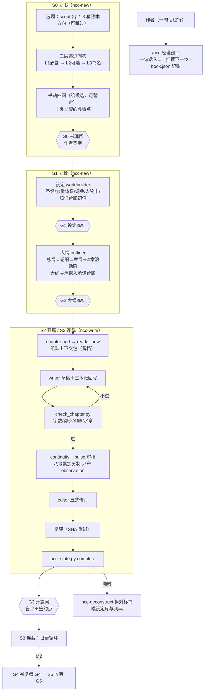

# ncc-workflow — Novel Create Center

ZCode 插件 · v0.2.0 · 个人本地插件

**小说创作中心**：长篇网文从立书到收束的完整工作流。它把长篇网文当作"边写边发、不可撤回、读者每章投票"的活来设计：先定书魂（这本书在追问什么），再立骨架，开篇签下类型契约，连载时每章都在建立、推进或兑现对读者的承诺。经理窗口调度九个创作角色，`book.json`＋三本账是唯一状态源，写-审-改三分离；每个需要作者决定的地方都给推荐、理由和备选，新手从一句模糊的想法也能走到开写。

架构说明见 [workflow/architecture.md](workflow/architecture.md)；设计全文（完善计划第六稿）在作者的 `~/Documents/grok-files/ncc-workflow/`。

## 流程总览



## 快速开始

```bash
# 在写作项目根目录
/ncc 我想写本书，但只有个模糊的想法          # 一句话入口：经理推荐下一步
/ncc-new 我想写一本都市+诡异+仙侠融合的文    # 开书：档位→方向→问答→书魂→设定→大纲，停在各闸门
/ncc-write 黄金三章                          # 开篇三章，走完整审稿循环与 G3
/ncc                                         # 看状态（含承诺开放/逾期、暂定决策）
/ncc-write 接着写                            # 日更
/ncc 这章卡住了                              # 卡文协议：先查该还哪笔账
/ncc-review 第12章 打回重写                  # 独立审稿
/ncc-deconstruct ~/Documents/网文拆解/Novels/某书.txt
```

脚本自检（无书也可跑）：

```bash
python3 scripts/test_ncc_state.py                                   # 状态机与机械检查自测
python3 scripts/ncc_state.py init /tmp/t/novels/测试 --title 测试 --level 新手
python3 scripts/ncc_state.py status /tmp/t/novels/测试
python3 scripts/ncc_state.py reader-now /tmp/t/novels/测试 1
python3 scripts/check_chapter.py <书目录> <章号>
```

v0.1 建的书：`python3 scripts/ncc_state.py migrate <书目录>` 升级到 schema 2（原伏笔台账保留）。

## 目录结构

```
ncc-workflow/
  .zcode-plugin/plugin.json     # 插件清单
  workflow/registry.json        # 层/阶段/角色/闸门/三本账/公理/铁律的唯一事实源
  workflow/architecture.md      # 五层决策·三本账·四循环·读者模型·引导层
  commands/                     # /ncc /ncc-new /ncc-write /ncc-review /ncc-deconstruct
  agents/                       # 9 角色：scout worldbuilder outliner writer
                                #         editor continuity pulse reader deconstructor
  skills/
    ncc/                        # 经理：mind-frame / guidance / stage-map / book-state / context-pack
    ncc-new/                    # 立书与立骨：qa-layers / book-soul / worldbuilding / outline
    ncc-write/                  # 写章：chapter-loop / golden-three（开篇与签约点）
    ncc-review/                 # 审稿：review-domains（八域细则+报告模板）
    ncc-deconstruct/            # 拆书：对接《小说拆分总纲 5.0》
  scripts/
    ncc_state.py                # 状态机：书/闸门/章节/三本账/读者此刻/迁移
    check_chapter.py            # 章节机械检查（汉字数/钩子/AI味/水章）
    test_ncc_state.py           # 自测
  docs/usage.md                 # 使用指南
  ACKNOWLEDGMENTS.md            # 设计出处与许可说明
```

书项目结构见 [skills/ncc/references/book-state.md](skills/ncc/references/book-state.md)。

## 核心机制

| 机制 | 说明 | 出处 |
|---|---|---|
| 书魂与类型契约 | 立书先答四问（主题之问、主角的答案、世界的不公、终局），可暂定；主契约＋毒点＋签约点 | 本插件（完善计划第五、六稿） |
| 五层决策 | 书魂→骨架→单元→章→文字，按可逆度分层；下层只能提变更提议 | 本插件 |
| 三本账 | 承诺账（欠读者什么）、知情账（谁知道什么）、世界账（状态事件＋知识台账） | Openwrite 伏笔义务 ＋ oh-story 作者真相/读者已知 ＋ 本插件 |
| 水章判据 | 一章既没建立、推进也没兑现任何承诺 → 机械检查不过 | 本插件 |
| 读者此刻 | 每章上下文包带信息差、在等的承诺、情绪位置、可能腻了什么 | 本插件 |
| 引导层 | 一次一问、推荐置顶、给备选、可暂定、按经验分档、一句话入口 | superpowers ＋ spec-kit ＋ AI-Novel-Writing-Assistant ＋ oh-story ＋ chinese-novelist-skill ＋ BMAD |
| 经理窗口＋角色帽 | `/ncc` 只做意图分类、派单、记账；具体工作派给 9 个专职子代理 | sdlc-workflow |
| book.json 单一状态源 | 状态只由脚本写入；MD 投影永不回写状态 | chinese-novelist-skill ＋ InkOS |
| 上下文包契约 | 无包不写：章纲＋读者此刻＋承诺义务＋人物卡＋意图＋前章结尾＋文风锚 | Openwrite ＋ InkOS ＋ chinese-novelist-skill |
| 八域累加审稿 | 只有引用正文的准则计分、问题不扣分、覆盖率独立、不适用从分母剔除、critical 只 block | Openwrite 审稿 DAG ＋ D11 |
| SHA 新鲜度＋强制复评 | 正文一变旧评审作废；修订是显式动作，写者不审己稿 | Openwrite ＋ InkOS ＋ sdlc 铁律 |
| 事件溯源台账 | 人物/关系/设定变化记状态事件，当前态=重放 | 拆书总纲 5.0 ＋ InkOS |
| 开篇盲评＋签约点 | reader 无上下文模拟真实读者；五个签约点须在前三章落地 | 网文共识 ＋ sdlc G-fresh |
| 确定性脚本闸门 | 字数/钩子/AI味/水章/闸门由脚本判定，退出码即结论；作者可 `--force` 放行并留原话 | chinese-novelist-skill |

## 路线

- **v0.2（本版，M1 架构核心）**：书魂与契约、三本账、读者此刻、水章、五层与变更提议、引导层（S0–S1）、阶段重编（D10）、八域框架（D11）。
- M2：单元/卷/书循环、S4 卷复盘与 S5 收束、关键章工序、契约域审稿、作者可持续、团队按层认领、引导层扩到 S3–S5。
- M3：底蕴卡库、scholar 角色、底蕴域审稿。M4：素材流。M5：文风与读者画像。

## 边界

- 一书一 `book.json`＋一套 `06-台账/`；多书共存于书库根目录。
- 不做：平台后台操作、发布排期、稿费合同、实时多人协同（团队按层认领在 M2）。
- 拆书只拆作者合法持有的作品；产物只存 5–15 字定位词引用。
- 文风基准每书一份；正文是正文，状态是状态，永不互写。

## 许可

个人本地插件。融合设计来自多个开源项目——只借鉴设计思想与方法论，未复制任何源代码；详见 [ACKNOWLEDGMENTS.md](ACKNOWLEDGMENTS.md)。
