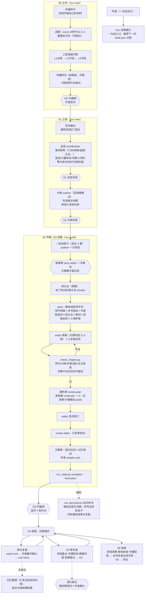

# ncc-workflow — Novel Create Center

ZCode 插件 · v3.0.1 · 个人本地插件

**小说创作中心**：长篇网文从立书到收束的完整工作流。它把长篇网文当作"边写边发、不可撤回、读者每章投票"的活来设计，由两台引擎组成：

- **下限引擎**（不出错、不烂尾）：书魂与类型契约、五层决策、三本账、读者此刻、水章判据、硬伤审、闸门与 SHA。
- **上限引擎**（让作品出彩）：先挖作者自己的种子再给推荐；人物写成有欲望、恐惧、伤口和声音的人；每章先写场景卡、过了故事审才写正文；写手只拿写作简报、看不到审稿清单和书魂原文；关键节拍写 2–3 版由作者挑；评价不打绝对分，关键章用成对比较与读者记忆测试。

**下限靠系统，上限靠作者与选择。** 经理窗口调度十一个创作角色，`book.json`＋三本账是唯一状态源，写-审-改三分离；每个需要作者决定的地方都给推荐、理由和备选。

**越写越懂这本书，但不越进化越歪。** 每个角色有自己的本书记忆和跨书记忆；作者在会话里说的话记成交接卡，按角色切给子代理（审稿与试读读者不拿，保住新鲜的眼睛）。拆书不只喂设定，还学写法：剧情、爽点、暗线、情绪、大局、人物、设定、文笔写成技法卡，排大纲时按题材挑来参考，用过之后按结果升降。设定类目（门派、种族、血脉、企业……）按题材研判、可以新提。记忆与技法自动积累；审稿标准这类规则要改，先过锚定章回归、再由作者确认，随时能撤回。

信息怎么放、谁能改、别处怎么用，按[信息架构七律](workflow/principles.md)：一事一源、副本只能生成、一处一主、按变化内聚、只经接口耦合、现状与历史分开、按需可见。架构说明见 [workflow/architecture.md](workflow/architecture.md)；设计全文（完善计划第七稿与架构审视）在作者的 `~/Documents/grok-files/ncc-workflow/`。

## 流程总览



## 快速开始

```bash
# 在写作项目根目录
/ncc 我想写本书，但只有个模糊的想法          # 一句话入口：经理推荐下一步
/ncc-new 我想写一本都市+诡异+仙侠融合的文    # 开书：档位→种子→技艺库→方向→问答→旧文采样→书魂→设定→大纲，停在各闸门
/ncc-write 黄金三章                          # 开篇三章：场景卡作者过目、关键节拍多版比选、G3
/ncc                                         # 看状态（含承诺开放/逾期、暂定决策）
/ncc-write 接着写                            # 日更
/ncc 这章卡住了                              # 卡文协议：先查该还哪笔账
/ncc 这个单元写完了                          # 单元复盘：底稿自动生成，集中确认暂定决策
/ncc 准备收尾                                # 收束：承诺清算、暗线收拢、书魂回答
/ncc 记一条素材：今天在医院走廊看到……        # 素材卡：来源、内容、可用处，写到合适的场景时送进写手包
/ncc 记住：这本书里"道友"是平辈通称          # 角色记忆：派单时自动带给用得上的角色
/ncc 上次我们怎么定的金手指？                 # 先在记忆、交接卡、台账、审稿里查，再回答
/ncc-review 第12章 打回重写                  # 独立审稿
/ncc-deconstruct ~/Documents/网文拆解/Novels/某书.txt
/ncc-deconstruct 学这本书怎么铺爽点           # 拆完一段写技法卡，进跨书技法库
/ncc 导出成 epub                              # 合稿与电子书：只收已定稿的章
/ncc 几本书一起看看                            # 多书仪表盘与承诺热力图
/ncc-eval 回归                                # 改了审稿判据后，用锚定章测检出率与稳定性
/ncc-eval 横评 第12章                         # 同一个写手包换不同模型写，盲评比较
```

脚本自检（无书也可跑）：

```bash
python3 -m unittest discover -s scripts -p 'test_*.py'              # 全部自测（含缺陷回归与下面两项）
python3 scripts/build_docs.py --check                               # 文档里由注册表生成的部分是否最新
python3 scripts/check_plugin.py -v                                  # 插件自查：链接、按名称引用、手写词表列举、各角色读取量
python3 scripts/ncc_state.py init /tmp/t/novels/测试 --title 测试 --level 新手
python3 scripts/ncc_state.py status /tmp/t/novels/测试
python3 scripts/ncc_state.py reader-now /tmp/t/novels/测试 1
python3 scripts/check_chapter.py <书目录> <章号>
python3 scripts/ncc_eval.py mech                                     # 锚定章机械层回归
python3 scripts/ncc_state.py memory list /tmp/t/novels/测试           # 各角色的记忆
python3 scripts/ncc_state.py setting catalog /tmp/t/novels/测试       # 设定类目表（标出与本书题材相关的）
python3 scripts/ncc_state.py evolve rules /tmp/t/novels               # 规则的生效值：插件默认还是作者覆盖
python3 scripts/ncc_state.py dashboard /tmp/t/novels --html /tmp/t/dash.html
```

旧书（schema 1–3）：`python3 scripts/ncc_state.py migrate <书目录>` 升级到 schema 4（原伏笔台账保留；手写的角色记忆转成条目）。

## 目录结构

```
ncc-workflow/
  .zcode-plugin/plugin.json     # 插件清单
  workflow/registry.json        # 唯一事实源：层/阶段/角色/闸门/三本账/公理/铁律/词表/书项目目录布局/各角色读取上限
  workflow/principles.md        # 信息架构七律
  workflow/architecture.md      # 五层决策·三本账·四循环·读者模型·引导层·记忆与进化
  workflow/memory-evolution-design.md  # 记忆、拆书学法与自进化的设计稿（已实现）
  commands/                     # /ncc /ncc-new /ncc-write /ncc-review /ncc-deconstruct /ncc-eval
  agents/                       # 11 角色：scout worldbuilder outliner story-editor scholar writer
                                #          editor continuity pulse reader deconstructor
  skills/
    ncc/                        # 经理：mind-frame / guidance / craft-canon / loops / finale / sustain / team /
                                #       stage-map / book-state / book-layout（生成）/ context-pack / memory；domains/（24 张底蕴卡）；
                                #       templates/：作者种子、文风基准、技艺库条目、ncc.config.yaml
    ncc-new/                    # 立书与立骨：qa-layers / book-soul / character / worldbuilding / outline / material
    ncc-write/                  # 写章：scene-card / writing-brief / chapter-loop / golden-three
    ncc-review/                 # 审稿：review-domains（三层评价细则+报告模板）
    ncc-deconstruct/            # 拆书：对接《小说拆分总纲 5.0》；拆完一段学写法、写技法卡
    ncc-eval/                   # 评测：锚定章回归、模型横评
  scripts/
    ncc_state.py                # 状态脚本的命令入口；实现按领域分在 ncclib/
    ncclib/                     # core（路径与词表，读注册表）→ ledgers 三本账 / materials 素材 / learning 文风偏好技艺库 /
                                #   memory 记忆交接检索 / settings 设定类目 / decon 拆书统计 → techniques 技法库 →
                                #   scenes 场景卡、写手包与派单头 → views 视图与自查 → loops 单元卷收束 / delivery 仪表盘导出 /
                                #   evolve 进化提议与覆盖层 → book 书与章 → cli
    check_chapter.py            # 章节机械检查（钩子/AI味分级与放行/水章/退化与元信息/底蕴与规避点提醒/身体小动作/场景卡照搬；字数交作者定）
    ncc_eval.py                 # 评测：锚定章机械层回归、审稿派单包与打分、模型横评、规则改动的闸门、新锚定章骨架
    build_docs.py               # 由注册表生成文档里的表格（信息地图、词表、记忆与交接、类目、技法、进化）、frontmatter、版本行（--check 只比对）
    check_plugin.py             # 插件自查：链接与路径、注册表与文件一致、写手文件无审稿判据、按名称引用、
                                #   版本只在 plugin.json、各角色读取量、手写词表列举与注册表一致
    test_ncc_state.py           # 主流程自测
    test_v3_regressions.py      # 13 项缺陷的行为回归
  eval/anchors/                 # 锚定章：故意埋了错的评测样章＋一章干净对照（答案不进派单包）；格式见 eval/README.md
  docs/usage.md                 # 使用指南（docs/完善计划.md 只是迁出说明）
  ACKNOWLEDGMENTS.md            # 设计出处与许可说明
```

书项目的信息地图见 [skills/ncc/references/book-state.md](skills/ncc/references/book-state.md)，目录契约与词表见 [book-layout.md](skills/ncc/references/book-layout.md)。

## 核心机制

| 机制 | 说明 | 出处 |
|---|---|---|
| 书魂与类型契约 | 立书先答四问（主题之问、主角的答案、世界的不公、终局），可暂定；主契约＋毒点＋签约点 | 本插件（完善计划第五、六稿） |
| 五层决策 | 书魂→骨架→单元→章→文字，按可逆度分层；下层只能提变更提议 | 本插件 |
| 三本账 | 承诺账（欠读者什么）、知情账（谁知道什么）、世界账（状态事件＋知识台账） | Openwrite 伏笔义务 ＋ oh-story 作者真相/读者已知 ＋ 本插件 |
| 水章判据 | 一章既没建立、推进也没兑现任何承诺 → 机械检查不过 | 本插件 |
| 读者此刻 | 每章上下文包带信息差、在等的承诺、情绪位置、可能腻了什么 | 本插件 |
| 引导层 | 一次一问、推荐置顶、给备选、可暂定、按经验分档、一句话入口 | superpowers ＋ spec-kit ＋ AI-Novel-Writing-Assistant ＋ oh-story ＋ chinese-novelist-skill ＋ BMAD |
| 经理窗口＋角色帽 | `/ncc` 只做意图分类、派单、记账；具体工作派给 11 个专职子代理 | sdlc-workflow |
| book.json 单一状态源 | 状态只由脚本写入；MD 投影永不回写状态 | chinese-novelist-skill ＋ InkOS |
| 上下文包契约 | 无包不写：章纲＋读者此刻＋承诺义务＋人物卡＋意图＋前章结尾＋文风锚 | Openwrite ＋ InkOS ＋ chinese-novelist-skill |
| 三层评价 | 硬伤层通过／不通过（带正文引用）；故事层在正文之前审场景卡；品质层只在关键章做成对比较与读者记忆测试，不打绝对分 | Openwrite 证据锚点 ＋ D13 ＋ TTCW 等研究 |
| 作者种子 | 开书先挖作者自己的画面、执念与经历；推荐标明源自哪条种子 | 本插件（对治同质化，Doshi & Hauser 2024） |
| 人物引擎 | 欲望、需要、恐惧、伤口、信错的那句话、矛盾、秘密、声音；角色采访；主角弧光 | Weiland ＋ 本插件 |
| 场景卡与故事审 | 每章 1–3 张场景卡（翻转、两难、目标情感、画面、风险升级），过故事审才写正文 | 麦基 ＋ Swain ＋ oh-story ＋ 本插件 |
| 写作简报与质检清单分离 | 写手只拿简报；审稿清单、分数阈值、书魂原文不进写手上下文 | 本插件（对治应试写作） |
| 发散—收敛 | 关键节拍写 2–3 版，成对比较后由作者选定 | 本插件 |
| 写作模式 | 建筑师／园丁／混合，大纲闸按模式检查 | 本插件 |
| 四循环与收束 | 单元、卷复盘由台账生成底稿，作者集中确认暂定决策；收束按清单清算承诺、收拢暗线；完本后写跨书技艺库 | 本插件 |
| 读者数据回流 | 真实数据与模拟读者判断并排登记，复盘时校准模拟读者 | 本插件（对治"模型与读者不一致"） |
| 作者可持续 | 存稿线与保更模式、倦怠信号、噪音隔离、卡文协议 | 本插件 |
| 底蕴层 | 24 张底蕴卡；场景卡标"知识"才按需派 scholar 出本章知识点清单（有来源或标待核）；写手只拿"写成什么"；时代错置、称谓、月相提醒；一书一深学与补学清单 | D3 ＋ 本插件 |
| 素材流 | 作者随手记的观察、经历、听来的事写成素材卡（来源、内容、可用处）；场景卡挂上编号，写手包带上内容、不带来源；转述来的真人真事附脱敏提示；复盘时列出没用过的素材 | 本插件（M5，艺术源于生活） |
| 代入感与规避点 | 作者 novel_guide 的经验整理成判据：长段、长句、对白流脚本告警；低潮不过章；主角在场、章尾停在变故处进故事审；标志细节进人物卡；新手档推荐偏稳 | 作者自有资产 |
| 社会洞察 | 世界观圣经写"不合理却存在"的规矩：谁受益、谁受害、主角在哪、对应书魂哪一面；G1 检查 | 本插件（M5-4） |
| 文风指纹 | 作者旧文（或第 1 章）算出句长、段长、对话占比、人称等指纹，只给审稿与漂移提醒；写手只拿语感、校准段、负面清单 | 本插件（M6-1） |
| 读者画像与热力 | 目标读者、老白、小白、懂行读者分别盲评，合成弃读热力；读者"在等什么"与台账推算的读者此刻对照 | 本插件（M6-2） |
| 偏好演化 | 偏好权重随时间衰减，作者否决过的降权不首推，雷点是硬约束 | chinese-novelist-skill 偏好记忆＋本插件（M6-3） |
| 技艺库回灌 | 完本写技艺库条目；下一本书开书时按题材、契约、弧光挑相关条目进推荐理由 | 本插件（M6-4） |
| 判据层回归评测 | 锚定章埋错，量审稿的检出率、定级、结论准确率、干净章误报与多次稳定性；改判据、换模型后重跑 | 本插件（M7） |
| 模型横评 | 冻结写手包 SHA，各模型同包写一版，盲稿成对比较，揭盲算胜率 | 本插件（M7） |
| 多书仪表盘 | 各书阶段、进度、存稿、承诺健康度；承诺热力图（文字版与离线网页） | 本插件（M7） |
| 导出 | md／txt 合稿、EPUB 3；只收已定稿的章，去掉修订注记 | 本插件（M7） |
| AI 味分级 | 五星句式出现即改、高危句式与一级词合计限额、二级词密度告警、作者放行清单 | oh-story story-deslop 清单（MIT）＋本插件 |
| SHA 新鲜度＋强制复评 | 正文一变旧评审作废；修订是显式动作，写者不审己稿 | Openwrite ＋ InkOS ＋ sdlc 铁律 |
| 事件溯源台账 | 人物/关系/设定变化记状态事件，当前态=重放 | 拆书总纲 5.0 ＋ InkOS |
| 开篇盲评＋签约点 | reader 无上下文模拟真实读者；五个签约点须在前三章落地 | 网文共识 ＋ sdlc G-fresh |
| 信息架构七律 | 每类信息一个源头（书项目的"信息地图"）；author-intent、续写状态卡、台账的 .md 都由脚本生成、勿手改，`check` 逐字比对；状态事件只追加；作者资产收进 `_作者/`，机器工作件收进 `.ncc/`。插件自身同样：词表与目录布局只在注册表，文档表格由注册表生成，手写的词表完整列举由自查比对，按标题名称引用，各角色读取量有上限 | 本插件（v2.0–2.1） |
| 欠字不补 | 字数不够不让写手补写或重写（硬凑会注水）：不少于下限一半按推荐先收、单元复盘确认，不到一半问作者；超长只做一次只删不加的压缩；写手分两段写、中途量一次字数 | oh-story（MIT）＋本插件 |
| 退化与元信息检查 | 复读、截断、占位与拒绝语、工程词漏进叙述必须修；场景卡原句照搬、身体小动作标注情绪只告警 | oh-story check-degeneration 与对照实验（MIT）＋本插件 |
| 面向作者的汇报 | 只讲写了什么、要你定什么、下一步；不出现命令、字段名和孤零零的编号 | oh-story（MIT） |
| 角色记忆 | 每个角色一份本书记忆、一份跨书记忆；独立证据两处才生效，正文相同才合并证据，相近正文由经理确认后合并，连续两个单元没再出现自动归档；写手与 editor 的记忆查审稿判据词与书魂原文；偏好仍只在偏好文件 | OpenClaw 分层记忆与压缩前落盘 ＋ Hermes Agent 自管记忆 ＋ 本插件（M8） |
| 会话交接卡 | 作者在会话里的原话与决定当场记下，按角色与作用层切给子代理；审稿与 reader 不拿；决定落进源头后关掉 | 本插件（M8，对治"子代理不知道作者刚说了什么"，又不拆掉盲读与写审分离） |
| 派单头与检索 | 写手以外的角色由脚本组装派单头（记忆、交接、技法）；`recall` 在记忆、交接、场景卡、审稿、台账里全文检索，按角色过滤 | Hermes Agent 跨会话检索 ＋ 本插件（M8） |
| 设定类目 | 门派、种族、血脉、家族、企业、王朝、宗教、职业、妖兽、功法、法宝、丹药、阵法、科技、组织、秘境，各带字段模板；按题材研判，表里没有的新提一类；卡里的数字走知识台账 | 本插件（M10） |
| 拆书学法与技法库 | 拆完一段写技法卡（手法、怎么做、证据、适用条件、代价），跨书共用；只用自己的话，和原文连续重合超过 15 字拒绝；按角色挑卡，审稿不拿；用过按结果升降 | Hermes Agent 从经验长技能 ＋ 本插件（M9） |
| 对标基线 | 脚本建章节索引、查覆盖率，从拆书台账算伏笔等待、爽点密度、压抑与释放；单元复盘拿本书和对标书对照，只作参照 | 拆书总纲 5.0 ＋ 本插件（M9） |
| 自进化四档 | 自动（记忆、技法状态）、作者确认（新类目、新技法类别、跨书晋升）、评测＋作者确认（章节检查的阈值与词表，锚定章回归变差就拒绝）、永不自动（铁律、公理、七律、可见范围、角色身份）；规则改动写进作者覆盖层，可撤回；漏检变锚定章 | Skill Misevolution（2026）的教训 ＋ 本插件（M11） |
| 确定性脚本闸门 | 字数/钩子/AI味/水章/闸门由脚本判定，退出码即结论；作者可 `--force` 放行并留原话 | chinese-novelist-skill |

## 路线

- v0.2（M1 架构核心）：书魂与契约、三本账、读者此刻、水章、五层与变更提议、引导层（S0–S1）、阶段重编（D10）。
- v0.3（M2 上限引擎）：作者种子、人物引擎、场景卡与故事审、写作简报与质检清单分离、发散—收敛与关键章比选、情绪调色板与"失去"线、名场面与母题、三层评价（D13）、发展编辑、写作模式（D15）、思维框架重写。
- v0.4（M3 循环与收束）：单元、卷、书三级复盘与复盘底稿、S4 卷复盘（G4）、S5 收束（G5）与技艺库、读者数据回流与模拟读者校准、创作宪法、文风放行机制、AI 味分级、主体性四问、作者可持续、团队认领与操作日志、S3–S5 引导决策点。
- v0.4.1（减重）：场景卡小批量、常规章一人审硬伤、复审只看改动、写手包由脚本组装（D16–D18）；常规章角色调用从 5 次降到约 2.7 次。
- v0.5（M4 底蕴层）：24 张底蕴卡入库、scholar、场景触发的知识点清单、定稿拦截、底蕴硬伤检查与提醒、时代背景、一书一深学与补学清单。
- v0.6（M5 素材层）：素材卡与素材流、作者资产接入（代入感与规避点判据、小说底盘作设定底料）、拆书逆向夹校（质感细节与机制样本、对标书书魂与契约）、社会洞察清单与 G1 检查。
- v0.7（M6 学习与嗓音层）：文风指纹与文风基准（旧文采样或第 1 章反推、漂移提醒）、读者画像盲评与弃读热力、读者此刻对照、偏好演化、技艺库回灌。
- v1.0（M7）：ncc-eval 锚定章回归与模型横评、多书仪表盘与承诺热力图、合稿与 EPUB 导出。计划原定"M1–M6 各跑通一本书"再做，按作者指示提前完成。
- v1.1（借鉴 oh-story 第一组）：欠字不补与分两段写、超长只删一次、退化与元信息检查、身体小动作提醒、场景卡照搬提醒、面向作者的白话汇报。
- v2.0（信息架构七律 A1）：书项目按七律归位——书魂、契约、目标读者只在 book.json，author-intent.md 改为生成的视图；数据只在知识台账；承诺只在承诺台账（名场面、母题清单由台账生成）；续写状态卡由 chapter end 与场景卡生成；状态事件只经 event add 追加；复盘数据写进可刷新的生成区块；作者资产收进 _作者/，机器工作件收进 .ncc/；render 与 check。书项目 schema 升到 3（migrate 自动搬家）。
- v2.1（信息架构七律 A2：插件内部）：词表与书项目目录布局只在注册表，脚本读它、文档由它生成（`build_docs.py`，自测比对）；状态脚本按领域拆成 ncclib/ 十个模块、依赖单向；规则只在一处讲全，别处一句话指过去；文档之间按标题名称引用（不写章节序号，自测查引用的标题存在）；版本号只在 plugin.json；每个角色每次调用读的规则有上限（自测统计）；文档里手写的词表完整列举由自查比对注册表，增删一个取值时漏改的列举会被拦下。顺带修正：园丁模式每批章数文档写成 1–2、脚本是 2，统一为 2；"何时可以打断作者"两处写法不一，合成一处；写章定稿一步还让写手手改续写状态卡，改为登记 chapter end。
- **v3.0（M8–M11：记忆、设定类目、拆书学法、自进化）**：角色记忆（本书与跨书，门槛、衰减、晋升）、会话交接卡按角色切片、脚本组装的派单头、全文检索；设定类目表与按题材研判；拆书的索引、覆盖率与对标基线脚本，技法库（八类技法卡、按角色挑卡、使用结果结算）；自进化四档、作者覆盖层、锚定章回归当闸门、漏检变锚定章。书项目 schema 升到 4（migrate 自动转手写的角色记忆）。设计稿见 `workflow/memory-evolution-design.md`。
- **本次修正（2026-10-03）**：修复会话审查确认的 13 项缺陷，覆盖进化闸门与撤回、记忆证据与跨书维护、写手技法隔离、配置优先级、设定字段保全、画像校准、拆书一致性及派单预算；新增 16 项行为回归和 5 个机械样例。书项目格式仍为 schema 4。
- 之后：用第一本真书跑通全流程，按评测结果校准判据与阈值、记忆门槛与技法匹配；oh-story 的其余借鉴项（读者契约四问、新增物三级、题材卡、按需一致性审查、原子台账事务等）按试书暴露的问题挑着做。

## 边界

- 一书一 `book.json`＋一套 `06-台账/`；多书共存于书库根目录。
- 不做：平台后台操作、发布排期、稿费合同、实时多人协同（按位置认领的团队用法已支持，见 team.md）。
- 拆书只拆作者合法持有的作品；产物只存 5–15 字定位词引用。
- 文风基准每书一份；正文是正文，状态是状态，永不互写。
- 子代理不全量继承主会话：按角色切片的交接卡代替；角色的身份与性格由插件定义，不随书演化。
- 规则改动不改插件本体，写进作者覆盖层；铁律、公理、七律、可见范围永不自动改。

## 许可

个人本地插件。融合设计来自多个开源项目——只借鉴设计思想与方法论，未复制任何源代码；详见 [ACKNOWLEDGMENTS.md](ACKNOWLEDGMENTS.md)。
