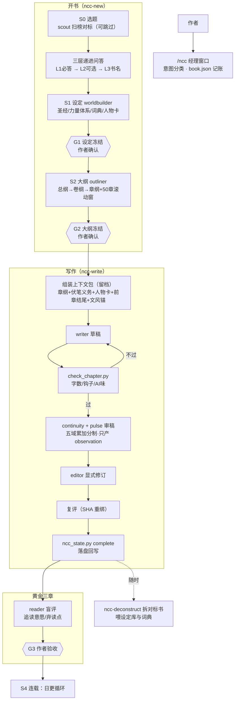

# ncc-workflow — Novel Create Center

ZCode 插件 · v0.1.0 · 个人本地插件

**小说创作中心**：把「一本网文从想法到连载」变成以读者留存为目标的流水线——选题对标先行，三层递进问答开书，设定与大纲冻结后才动笔，黄金三章过盲评才进连载；每章走「上下文包→写作→机械检查→五域审稿→修订→复评→落盘回写」。经理窗口调度九个创作角色，`book.json` 是唯一状态源，写-审-改三分离，每一步结论落在磁盘工件上，不靠口头汇报。

目录骨架参照 [sdlc-workflow](../sdlc-workflow)；方法论融合 [Openwrite](https://github.com/LiPu-jpg/Openwrite)、[InkOS](https://github.com/Narcooo/inkos)、[chinese-novelist-skill](https://github.com/PenglongHuang/chinese-novelist-skill) 三个开源项目与主流网文工业流（见 [ACKNOWLEDGMENTS.md](ACKNOWLEDGMENTS.md) 的设计出处表）。

## 流程总览



## 快速开始

```bash
# 在写作项目根目录
/ncc-new 我想写一本都市+诡异+仙侠融合的文        # 开书：问答→设定→大纲，停在冻结确认
/ncc-write 黄金三章                              # 写1-3章并走完整审稿循环
/ncc                                             # 看状态
/ncc-write 接着写                                # 日更
/ncc-review 第12章 打回重写                      # 独立审稿
/ncc-deconstruct ~/Documents/网文拆解/Novels/某书.txt   # 拆对标书喂设定库
```

脚本自检（无书也可跑）：

```bash
python3 scripts/ncc_state.py init /tmp/t/novels/测试 --title 测试
python3 scripts/ncc_state.py status /tmp/t/novels/测试
python3 scripts/check_chapter.py <书目录> <章号>
```

## 目录结构

```
ncc-workflow/
  .zcode-plugin/plugin.json     # 插件清单
  workflow/registry.json        # 阶段/角色/闸门/铁律的唯一事实源
  commands/                     # /ncc /ncc-new /ncc-write /ncc-review /ncc-deconstruct
  agents/                       # 9 角色：scout worldbuilder outliner writer
                                #         editor continuity pulse reader deconstructor
  skills/
    ncc/                        # 经理技能：stage-map / book-state / context-pack
    ncc-new/                    # 开书：qa-layers / worldbuilding / outline
    ncc-write/                  # 写章：chapter-loop / golden-three
    ncc-review/                 # 审稿：review-domains（五域细则+报告模板）
    ncc-deconstruct/            # 拆书：对接《小说拆分总纲 5.0》
  scripts/
    ncc_state.py                # book.json 状态机（init/status/next/gate/complete/sha）
    check_chapter.py            # 章节机械检查（汉字数/钩子登记/AI味词表）
  docs/usage.md                 # 使用指南
  ACKNOWLEDGMENTS.md            # 设计出处与许可说明
```

书项目结构（`{book_root}/{书名}/`）见 [skills/ncc/references/book-state.md](skills/ncc/references/book-state.md)。

## 核心机制

| 机制 | 说明 | 出处 |
|---|---|---|
| 经理窗口＋角色帽 | `/ncc` 只做意图分类、派单、记账；具体工作派给 9 个专职子代理 | sdlc-workflow |
| book.json 单一状态源 | 进度/恢复/闸门/审稿摘要四合一；MD 投影永不回写状态 | chinese-novelist-skill ＋ InkOS |
| 三层递进问答＋偏好记忆 | L1 必答三问→L2 可选五问→L3 书名；偏好跨书共享驱动⭐与🎲 | chinese-novelist-skill |
| 上下文包契约 | 无包不写：章纲+伏笔义务+人物卡+前章结尾+文风锚，落档可追溯 | Openwrite ＋ InkOS ＋ chinese-novelist-skill |
| 五域累加审稿 | 只有引用正文的准则计分、问题不扣分、覆盖率独立、critical 只 block | Openwrite 审稿 DAG |
| SHA 新鲜度＋强制复评 | 正文一变旧评审作废；修订是显式动作，写者不审己稿 | Openwrite ＋ InkOS ＋ sdlc 铁律 |
| 伏笔义务清单 | due/to_plant/overdue 进每章工作简报；伏笔不登记等于不存在 | Openwrite ＋ 拆书总纲 5.0 |
| 事件溯源台账 | 人物/关系/设定变化记状态事件（old→new+证据），当前态=重放 | 拆书总纲 5.0 ＋ InkOS |
| 黄金三章盲评 | reader 无上下文模拟真实读者：追读意愿/弃读点/划线点 | 网文共识 ＋ sdlc G-fresh |
| 50 章滚动窗 | 章纲只维护未来 ~50 章，写完一卷再扩 | Openwrite |
| 拆书喂设定库 | 对标书按总纲 5.0 拆解，产物直接并入设定词典（带来源与置信级） | 拆书总纲 5.0 |
| 自动化边界 | 问答与冻结由作者拍板；写作/审稿执行阶段禁停顿 | chinese-novelist-skill |
| 确定性脚本闸门 | 字数/钩子/AI味由脚本判定，退出码即结论，LLM 不自评 | chinese-novelist-skill |

## 边界

- 一书一 `book.json`；多书共存于书库根目录。
- 不做：平台后台操作、发布排期、稿费合同、多机协作（git 足够）。
- 拆书只拆作者合法持有的作品；产物只存 5–15 字定位词引用。
- 文风基准每书一份；正文是正文，状态是状态，永不互写。

## 许可

个人本地插件。融合设计来自三个开源项目（AGPL-3.0 / Apache-2.0 / MIT）——只借鉴设计思想与方法论，未复制任何源代码；详见 [ACKNOWLEDGMENTS.md](ACKNOWLEDGMENTS.md)。
