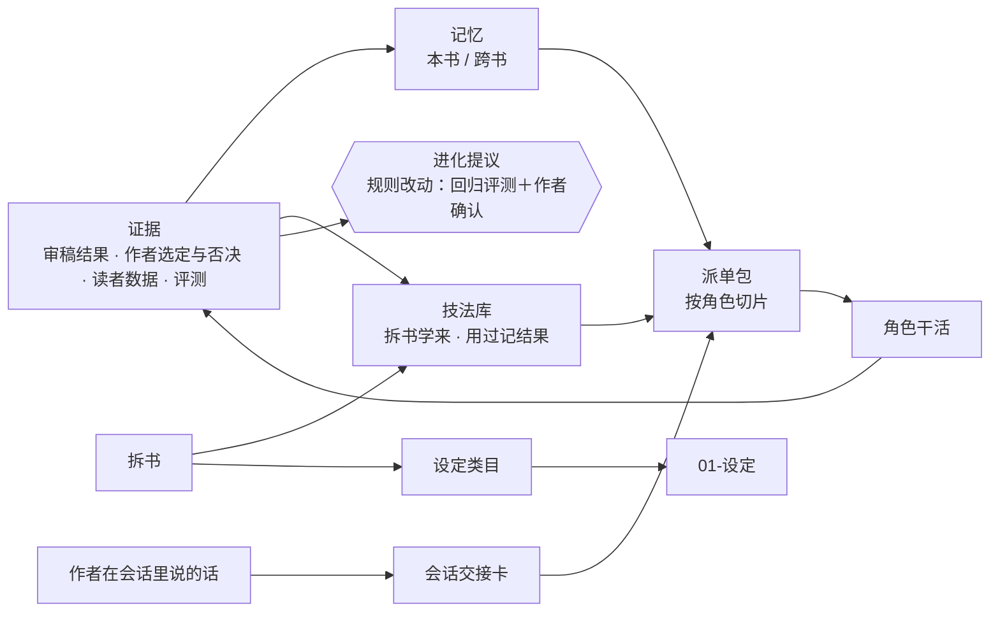

# 记忆、拆书学法与自进化：设计稿

状态：**已实现（v3.0）**。落地说明见 `workflow/architecture.md` 的"记忆、设定类目、拆书学法与自进化"一节；本稿留作设计记录，实现时的调整列在文末"实现时的调整"。

2026-10-03 缺陷修正：相似正文不再自动强化，由经理确认同义后合并；独立证据去重；跨书记忆可用 `--shared` 维护；派单执行整条字数预算和统一的技法状态/可见范围检查。规则闸门覆盖全部机械提醒与 AI 必须修，撤回保留其余生效提议；配置增加明确的书库层，新技法类别继承内置父类。实际命令以 `memory.md`、`loops.md` 和脚本帮助为准；本稿以下保留原设计。

作者 2026-10-01 已定的三条：

1. 子代理不全量继承主会话，用**按角色切分的会话交接卡**。
2. **记忆自动、规则设闸**：记忆与技法自动积累并留痕；改审稿判据和规则，先过回归评测、再由作者确认，可撤回。
3. 先写本设计稿，审过再动手。

## 现状与缺口

| 要的能力 | 现在有 | 缺口 |
|---|---|---|
| 身份、性格 | 11 个角色定义里都有 SOUL（信条）与 IDENTITY（头衔、使命） | 够用；本稿不让它自己演化，理由在下文"身份不演化" |
| 记忆 | 目录契约里有 `memory/`（每个角色一份）；经理技能提到经理记本书约定，loops.md 提到 reader 记校准 | 没有脚本写，派单包不带；其余角色实际没有记忆 |
| 学习 | 文风指纹与基准；偏好衰减与否决；真实读者数据校准模拟读者；完本写技艺库、下一本开书回灌 | 只在开书和完本两头学；写作中途反复出现的问题、作者一再否决的写法，不会变成下一章的经验 |
| 会话上下文 | 写手包由脚本组装；其余角色的派单由经理手写 | 作者在会话里刚说的话、刚做的决定，全靠经理记得写进派单 |
| 拆书 | 按总纲 5.0 抽实体、关系、状态事件、伏笔、情绪点；伏笔节奏统计、节奏与爽点报告、质感与机制样本、对标书的书魂与契约 | 学的是"书里有什么"，不是"怎么写的"；报告留在拆书库，大纲与故事审的派单不读；索引、覆盖率、统计全靠手工 |
| 设定类目 | 世界观圣经固定六节（世界层、力量源、地理、势力、社会、世界秘密）；素材另有素材层 | 门派、种族、血脉、企业等没有字段模板，也不能按题材增减类目 |

## 不变的东西

- **三道保险**：reader 盲读；写手看不到审稿判据与书魂原文（铁律 9）；审稿不带生产方记忆。新增的记忆、交接、技法进哪个角色的上下文，都按这三条切。
- **七律**：每类新信息一个源头、一个写者（脚本）；派单里看到的都是脚本生成的切片；历史只追加；按需可见。
- **规则有成本**：每样进角色上下文的东西都有字数上限，计入预算。经理"开新书"这一路的规则读取量已到 31518，上限 35000，新规则放进单独的参考文件，只在用到时读，经理技能本身只加指针。
- **不依赖宿主特性**：没有找到 ZCode 支持子代理记忆或复制会话上下文的迹象。全部由脚本完成，只用标准库，换宿主也能用。
- **脚本不调用模型**（同评测）：哪条该记、两条该不该合并，由经理和角色判断；脚本只负责存取、去重候选、检索、计数、闸门与可见范围。
- **常规章不加角色调用**：记忆提议搭在现有的交回摘要上，整理每单元一次，学法只在拆书时做。常规章仍约 2.7 次调用。

## 总图



## 记忆与交接（M8）

### 记忆分层

| 层 | 放哪 | 写者 | 进派单吗 | 上限 |
|---|---|---|---|---|
| 身份 | `agents/<角色>.md` 的 SOUL、IDENTITY | 插件 | 是（角色定义本身） | 计入现有读取上限 |
| 本书记忆 | 书目录 `memory/<角色>.json`（源）；`memory/<角色>.md`（生成的视图） | 脚本（`memory` 命令） | 是，只给本角色 | 每角色 600 字、20 条 |
| 跨书记忆 | `{书库}/_作者/记忆/<角色>.json`＋视图 | 脚本 | 是，按适用条件挑 | 每角色 300 字 |
| 历史 | `.ncc/记忆日志.jsonl`：每次新增、强化、合并、归档、撤回 | 脚本，只追加 | 否；`recall` 可搜 | — |

`memory/` 已在目录契约里，这里给它定格式、定写者。现有的 `memory/reader.md` 校准备注由 `migrate` 转成"校准"条目。三类经验各有一个家，不互相抄：

- **偏好**（`pref`）：作者喜欢什么、不要什么、雷点。
- **技艺库与技法库**：作品层面什么写法成立，给经理推荐和规划角色用。
- **角色记忆**：这个角色干这份活容易错在哪、本书有什么约定。

### 记忆条目

```json
{"id": "MEM-0007", "kind": "教训",
 "text": "打斗场面每场只留一个转折动作，其余用结果带过",
 "evidence": ["ch-0012 审稿 O-3", "ch-0019 审稿 O-1", "ch-0027 审稿 O-2"],
 "since": 12, "last": 27, "hits": 3, "status": "active",
 "applies": {"题材": ["仙侠"], "阶段": "连载"}}
```

- **种类**（新词表 `memory_kinds`）：约定（本书特有的规矩，如"道友是平辈通称"）、教训（反复出过的问题，写成以后怎么做）、手感（作者选定或读者买账的做法）、校准（reader 画像的偏差，已有）。
- **门槛**：同类证据至少两处才记（一次侥幸不成经验）；"约定"一处即可，作者原话就是证据。
- **状态**：active → archived（连续两个单元没再出现）或 superseded（被合并）；归档不删，日志可查、可撤回。

### 谁写、什么时候写

1. **角色提议**：每个角色交回摘要时可以附一节"记忆提议"（每条：种类｜一句话｜证据），没有就不写。角色定义里只加一行格式说明，每个角色的读取量增加约 150 字。
2. **经理执行**：`ncc_state.py memory add <书目录> --role writer --kind 教训 --text … --evidence …`。脚本：
   - 和已有条目相似（按字的二元组重合度判断）→ 不新建，给旧条目加一次命中和证据；
   - 写手记忆里出现书魂原文 → 拒绝（复用 `pack` 现有的书魂检查）；出现审稿判据词 → 拒绝（判据词表现在只写死在 `scripts/check_plugin.py` 里查插件文件，挪进注册表，两处共用）；
   - 看起来是作者偏好（"作者喜欢……""不要……"）→ 拒绝，提示改用 `pref`；
   - 超出上限 → 照记，`status` 提醒下次整理时压缩。
3. **跨角色**：审稿反复抓到的问题，由经理在单元整理时转写成写手的"教训"——写成"怎么写"，不搬判据原文。角色之间不互相读记忆。
4. **单元整理**（相当于 OpenClaw 在压缩前把要紧的写进长期记忆）：`unit close` 前跑 `memory consolidate`，底稿列出可合并的、两个单元没再出现的、超上限的、够格进跨书记忆的（命中 ≥ 3 且不是"约定"）。经理按底稿 `merge`、`archive`、`promote`；改动写进单元复盘的生成区块，用白话告诉作者。作者说"撤回这条"就 `memory restore`。
5. **完本**：跨书候选随技艺库一起列在全书复盘里，默认晋升，作者可以划掉。

### 各角色记什么

| 角色 | 记什么 | 不记什么 |
|---|---|---|
| 经理 | 本书约定、作者的工作节奏（什么时候可以打扰） | 偏好（在 `pref`） |
| scout、worldbuilder、outliner、story-editor | 本书约定、规划上反复出的问题、作者选定的规划手感 | 正文细节 |
| writer | 写成什么：教训和手感都转成写法 | 审稿判据、书魂原文、评分 |
| editor | 本书常用的修法、放行过的写法 | — |
| scholar | 本书已核实的口径、常错的知识点 | — |
| continuity、pulse | 本书约定（避免误报）、自己的误报与漏检 | 生产方的讨论、写手记忆 |
| reader | 只有画像校准（已有） | 其他一切 |
| deconstructor | 拆书口径约定（别名归一的规矩等） | — |

### 会话交接卡

作者在会话里说的话，经理当场记下，派单时按角色切给它——这就是子代理"继承会话"的方式。

- **源**：`.ncc/交接/会话.jsonl`，只追加。每条：编号 H-NNNN、时间、种类（原话、决定、情绪、待办）、作者原话或忠实转述、作用层（L0–L4）、作用范围（章号、单元，或"本次会话"）。
- **写**：`ncc_state.py handoff add <书目录> --kind 决定 --layer L3 --ch 15-18 --text "…"`。作者说了会影响后面工作的话就记：一个决定、一句"这几章想写得狠一点"、一句"今天状态不好，少问我"。
- **落盘时机**：上下文快满或会话要结束时，经理先把还没记的作者原话补进交接卡，再继续（相当于 OpenClaw 压缩前落盘）。ZCode 若支持压缩前的钩子，可以让钩子提醒经理；没有也不影响。
- **切片**（注册表 `handoff.visibility`）：

| 角色 | 拿哪些 |
|---|---|
| 经理 | 全部 |
| scout、worldbuilder、outliner、story-editor | 作用层在自己管的层以内的全部种类 |
| scholar、deconstructor | 和本次任务有关的"决定" |
| writer | 作用范围覆盖本章、层在 L3–L4 的"原话"与"决定"；L0 书魂层的一律不给 |
| editor | L4 的"决定" |
| continuity、pulse、reader | **不给**。作者的决定只要影响审稿，必然已经落进台账、场景卡或放行清单，审稿看源头 |

- **过期**：超出作用范围的不再进派单。单元整理时列出还没落进源头的"决定"，经理把它写进该去的地方（台账、场景卡、偏好、记忆）后关掉。交接卡是过渡，不是第二个源头。

### 派单包统一由脚本组装

现在只有写手包由脚本组装。新增 `ncc_state.py brief <书目录> --role <角色> [--ch …] [--task …]`，给其余角色出派单头，落档到 `.ncc/派单/`，内容按顺序：

1. 本角色的本书记忆切片
2. 跨书记忆（按题材、阶段挑）
3. 会话交接切片
4. 技法卡（M9 之后；只挑本角色可见的类别）
5. 本次任务要读的路径（沿用 `skills/ncc/references/context-pack.md` 里各角色的包内容）

写手仍用 `pack`：protected 层加"本书记忆"（≤ 600 字）和"作者刚说的"（≤ 300 字），compressible 层加"文笔参考"（M9 之后，≤ 300 字）。写手包总量仍按 `context-pack.md` 的"预算"。reader 盲评包不变。

### 检索

`ncc_state.py recall <书目录> <词…> [--role <角色>] [--from 章] [--to 章]`：在记忆、记忆日志、交接卡、场景卡、审稿报告、台账里做全文检索（标准库，按字的二元组打分），返回带位置的片段。`--role` 按该角色的可见范围过滤来源，写手查不到审稿报告。主要给经理用：作者问"上次我们怎么定的"，先查再答。

不做向量检索：只用标准库，几百章的书全文检索够用。

### 身份不演化

角色的 SOUL 与 IDENTITY 由插件定义，不随书改写。会演化的"性格"正是自进化最容易歪的地方——一个越来越宽容的审稿人，每一步看起来都合理。本书特有的东西进记忆的"约定"。

## 设定类目按需增减（M10）

### 类目表

注册表新增 `setting_categories`，每类写明名称、别名、常见题材、字段（必填、选填），以及和三本账的接口：哪些字段的数字进知识台账，哪些变化记状态事件。首批举四例：

| 类目 | 必填字段 |
|---|---|
| 门派／宗门 | 定位一句话、地盘、传承与功法、门规（含一条"不合理却存在"的）、晋升路径、资源来源、和主角的关系、秘密 |
| 种族 | 外形与感官、寿命与繁衍、天赋与短板、禁忌、和其他种族的关系、和力量体系的接口 |
| 血脉 | 来源、觉醒条件、表现、代价、传承规则（遗传、稀释、返祖）、稀有度、和力量体系的关系、谁想要它 |
| 企业／商会 | 主营、实际控制人、钱从哪来、灰色地带、和权力的关系、和主角的利益、内部派系 |

其余首批类目：家族、王朝与国家、宗教与教派、职业与行当、妖兽与物种、功法、法宝与道具、丹药与资源、阵法与符箓、科技与装置、组织与机构。字段实现时逐类定，原则一样：只留会进剧情的字段，每类都有"和主角的关系"和"秘密或代价"。

### 每本书研判

立骨时 worldbuilder 加一步**类目研判**：按题材、主契约、大纲需要，提出本书用哪些类目，各附一句"它会怎么进剧情"；类目表装不下的，新提一类，给出字段和"为什么现有类目装不下"。作者在 G1 一起确认。

- **源**：`book.json` 的 `setting_categories`（用了哪些，本书新增的类目与字段）。
- **条目**：`01-设定/类目/<类目>/<名字>.md`，由 `ncc_state.py setting add <书目录> <类目> <名字>` 按字段建卡；没定的写"待定"。
- **检查**：`setting check` 查必填字段写了或标了待定、名字进了设定词典、数字走知识台账；`gate settings` 查每个用到的类目至少有一条，或写明不适用。
- **兼容**：世界观圣经的"势力"一节保留，改成一句话定位加指向类目卡。类目是增量，旧书不用就不查。

### 新类目怎么进化

本书新增的类目只对本书有效。同一个新类目在两本书里都用过，进化提议会建议收进插件类目表（规则级改动，作者确认）。拆书遇到装不进现有类目的设定，进"未归类"池，攒够了也会提议新类目。

## 拆书学写法（M9）

### 技法类别

新词表 `technique_kinds`，首批八类：大局设计、剧情规划、爽点规划、暗线伏笔、情绪调用、人物塑造、设定构造、文笔参考。遇到八类装不下的手法（比如群像调度、系统面板设计），deconstructor 可以提新类别，走和新类目一样的确认路径。

### 学法一步

拆书现有四步（章节索引、逐章抽取、归一与台账、产出喂料）之后加一步**学法**：每拆完一段（30–50 章或一卷）做一次，全书拆完再做一次。deconstructor 读本段的抽取台账与统计，不重读原文，写技法卡：

| 字段 | 说明 |
|---|---|
| 手法 | 一句话，用自己的话 |
| 怎么做 | 2–4 步 |
| 证据 | 拆:书名 第N章＋5–15 字定位词；一处叫"样本"，同一本书两处以上叫"手法" |
| 适用条件 | 题材、阶段（开篇、单元中段、卷末、收束）、主契约、篇幅 |
| 代价与失效 | 什么情况下会变成套路或踩毒点 |
| 数据 | 可选：脚本算出的间隔、密度 |
| 置信级 | 原文明说、强推断、弱推断 |

存放在 `{书库}/_作者/技法库/<类别>/T-NNNN.md`（跨书共用）。版权口径不变：只用自己的话概括，定位词 5–15 字；`technique check` 拿卡片和拆书库原文比对，连续 16 字以上相同就拒绝。

### 统计由脚本算

新增 `ncc_state.py decon <拆书库/书名> index|coverage|stats`：

- **index**：按章标题切分，记起止行、字数、hash，即总纲要求的章节索引。
- **coverage**：索引章数 = 已拆 + 显式跳过，不相等不出统计。
- **stats**：从抽取台账（伏笔、情绪点、爽点，统一成 jsonl，每条带章号、证据、置信级）算出：伏笔从埋到回收的等待章数分布与强化次数、每 10 章的爽点密度与从铺垫到兑现的间隔、压抑与释放的连续章数、章尾钩子类型分布、单元与卷的长度。写 `报告/基线.json` 和视图。

基线进单元与卷复盘底稿，做"本书和对标书"的对照：伏笔平均等待、爽点密度、最长连续压抑。只作参照，不作判据。

### 谁拿什么

`technique match` 按题材、主契约、阶段、本批场景卡涉及的承诺类型打分；按状态加权（已验证 > 手法 > 样本）；作者否决过的降权（复用偏好的否决机制）；**同一本对标书每次最多两张**，防止照着一本书写。

| 角色 | 拿哪些类别 | 上限 |
|---|---|---|
| scout | 大局设计 | 3 张 |
| worldbuilder | 设定构造、人物塑造 | 3 张 |
| outliner | 大局设计、剧情规划、爽点规划、暗线伏笔、情绪调用 | 5 张，1500 字 |
| story-editor | 同 outliner，再加人物塑造；当参照，不当清单 | 5 张 |
| writer | 只拿文笔参考，由脚本转成"写成什么"一两句，不带证据和出处 | 300 字 |
| continuity、pulse、reader | 不拿。技法一进审稿就成了判据 | — |

推荐理由的排序在原有基础上加一层：作者种子 > 技艺库 > 技法库 > 题材常规。story-editor 审场景卡时多问一句：借了哪张卡、改了什么——借写法，不借事件链。

### 用过记结果

场景卡加一栏"技法：T-NNNN"（`scene check` 查编号存在）。用了这张卡的章，结果如何——故事审过没过、作者选没选这一版、读者数据——在单元整理时回写到卡上。卡的状态随之升降：本书用过且结果好 → 已验证；连续两次结果差 → 停用候选。

## 自进化闭环（M11）

### 证据从哪来

全是已有的：审稿结果（`05-审稿/`）、作者的选定与否决（`chapter pick`、闸门结论、`pref`）、读者数据（`feedback`、`heat`）、评测（`scripts/ncc_eval.py`）、技法用后的结果。

### 四档改动

| 档 | 改什么 | 怎么生效 | 撤回 |
|---|---|---|---|
| 自动 | 记忆的新增、强化、合并、归档；技法卡的权重与状态；类目使用统计 | 脚本直接执行，单元复盘用白话列出 | `memory restore`、`technique restore` |
| 作者确认 | 本书新类目、新技法类别；跨书记忆晋升（完本时可划掉） | 复盘或闸门时呈给作者 | 同上 |
| 评测＋作者确认 | 审稿判据（`review-domains.md`、`check_chapter.py` 的阈值与词表）、写作简报模板、插件类目表与技法类别表 | 写成进化提议 EP-NNNN → 跑回归评测 → 作者确认 → 生效 | 回到上一版 |
| 永不自动 | 铁律、公理、七律、谁能看到什么、角色身份 | 只有作者主动要求才改 | — |

### 规则改动放哪

写书时插件目录保持只读。通过闸门的规则改动写进作者自己的覆盖层 `{书库}/_作者/进化/覆盖.json`（阈值、词表增删、新类目、新技法类别）。脚本读取时按"插件默认 < 作者覆盖 < 本书设置"合并；`ncc_state.py rules` 列出每项的生效值和来源。一事一源仍成立：插件默认只在注册表，作者的改动只在覆盖层。在多本书里都站住了的覆盖，再由开发会话收进插件本体。

### 回归评测当闸门

- 机械层（`ncc_eval.py mech`）必须全过。
- 审稿层：检出率不低于改动前，干净对照章零误报，多次运行的稳定性不降。
- **漏检变锚定章**：读者或作者事后发现了审稿漏掉的问题，就把那一段转写成新的锚定章（原创复述，不摘正文）加进 `eval/anchors/`，再改判据。评测集随书一起长。

### 防止越进化越歪

研究表明，会给自己沉淀技能的智能体，很容易把一次侥幸成功的坏做法固化成套路（见文末参考）。对策：

- **一次成功不成经验**：自动档至少要两处独立证据。
- **会衰减**：记忆两个单元没再出现就归档；技法权重沿用偏好的半衰期。
- **看得见**：每个单元的自动改动都用白话列给作者，可以逐条撤回。
- **可见范围由脚本守**：每次写入都查写手能看到的东西里有没有审稿判据和书魂原文。
- **防同质化**：技法按来源书限量，推荐仍先从作者种子长出来。

## 落地清单

| 里程碑 | 注册表 | 脚本（ncclib） | 文档与角色 | 验收 |
|---|---|---|---|---|
| M8 记忆与交接 | memory（格式、上限、可见范围）、memory_kinds、handoff.visibility；layout 加记忆日志、交接、派单 | `ncclib/memory.py`（只依赖 core）；brief 与 recall 排在 views 之后；`unit close` 接整理；书项目 schema 3 → 4，`migrate` 补空结构 | 新增经理参考文件"记忆与交接"，经理技能只加指针；11 个角色定义各加一行"记忆提议"格式；`context-pack.md` 加 brief 与新增的层 | 同类问题记两次后出现在下一章写手包；reader 包里没有记忆和交接；写手记忆写入审稿判据词被拒；常规章角色调用数不变；各角色读取量仍在上限内 |
| M10 设定类目 | setting_categories；layout 加 `01-设定/类目/` | `ncclib/settings.py`（setting add、check，类目研判记录）；`gate settings` 扩展 | worldbuilding.md 加"类目研判"；deconstructor 抽取时按类目归类 | 新书能选类目、新提类目并建卡；旧书 `check` 照过；拆书产出能直接并入类目卡 |
| M9 拆书学法 | technique_kinds、技法状态、各角色可拿的类别与上限；layout 加技法库、拆书库 jsonl | `ncclib/decon.py`（index、coverage、stats）；`ncclib/techniques.py`（add、check、match、use） | ncc-deconstruct 加"学法"一步；deconstructor 加技法卡格式；scout、worldbuilder、outliner、story-editor 的派单带技法；场景卡加"技法"一栏 | 用自写的样章跑通索引 → 抽取 → 统计 → 技法卡 → 派单匹配；技法卡与原文 16 字重合被拒；单元底稿出现对标基线 |
| M11 自进化 | evolution（四档、闸门、永不自动清单） | `ncclib/evolve.py`（propose、list、apply、revert、rules）；core 合并覆盖层；`ncc_eval.py` 加改动前后对比 | loops.md 的单元与卷复盘加"进化"一块；G4 呈示规则提议与评测结果 | 一条判据改动走完提议 → 回归 → 确认 → 生效 → 撤回；回归变差时 apply 被拒 |

四个里程碑合成一个版本交付（v3.0；书项目 schema 升到 4，旧书要 migrate），自测、`build_docs.py --check`、`check_plugin.py` 全过。

## 待作者确认的细节

每条都给了推荐值，不回复就按推荐做：

1. **记忆上限**：本书记忆每角色 600 字、20 条，跨书 300 字。推荐先用这组，试书后按读取量调。
2. **跨书记忆晋升**：完本时默认晋升，作者可以划掉（与"记忆自动"一致）。
3. **技法卡升级门槛**：同一本书两处证据算"手法"，两本书都有才标"通用"。
4. **规则改动的去处**：放作者覆盖层，写书时不改插件本体。
5. **顺序**：M8 → M10 → M9 → M11。记忆是地基；类目改动小、见效快；学法依赖前两者；进化最后接。

## 实现时的调整

- **四个里程碑一起交付**：原计划每个里程碑一个次版本；实际一次交付为 v3.0（书项目 schema 3 → 4 需要 migrate，按语义化版本算大版本）。
- **技法库不另建索引文件**：卡片每次现扫，避免出现第二份要同步的东西（七律二）。卡的状态（样本、手法、已验证、停用）也不存，由证据数和只追加的使用记录推出。
- **写手只拿场景卡引用了的文笔参考卡**：设计稿写的是"按匹配挑"；实现时改成只带 outliner 在场景卡里引用的卡——自动挑容易让写手照着一本书写，引用了才带，可追溯。
- **规划角色的交接切片只含"原话"与"决定"**：情绪与待办只给经理自己。
- **拆书库的统计台账统一成 jsonl**：伏笔、爽点、情绪点、钩子、单元、实体各一份，字段见 `skills/ncc-deconstruct/SKILL.md` 的"归一与台账"；`decon stats` 只读它们。
- **章节检查的默认阈值与两份词表挪进注册表**：覆盖层要能改它们，就得先有一个源头（七律一）。`check_chapter.py` 读注册表、再叠作者覆盖层、最后叠 `ncc.config.yaml`。
- **评测闸门只跑机械层**：覆盖层能改的都是脚本层的阈值和词表，用 `ncc_eval.py gate` 对比改动前后的锚定章机械层结果；审稿文档（模型执行的判据）的改动仍按 ncc-eval 的判据层回归走，在开发会话里改插件本体。

## 参考

- OpenClaw 记忆：引导文件（SOUL、IDENTITY、USER、MEMORY）、每日笔记、记忆检索、压缩前落盘。[概念文档](https://github.com/openclaw/openclaw/blob/main/docs/concepts/memory.md)，[记忆架构](https://docs.openclaw.ai/concepts/memory-architecture)
- Hermes Agent（Nous Research）：自管记忆与定期提醒、从经验生成技能并在使用中改进、跨会话全文检索、用户建模。[仓库](https://github.com/nousresearch/hermes-agent)，[文档](https://hermes-agent.nousresearch.com/docs/)
- Practice Makes Unsafe: Skill Misevolution in Self-Improving LLM Agents（2026）：会进化技能的配置普遍把不安全的做法固化下来，触发它的输入消失后仍被复用；结论是持续自适应必须同时管住"写进去什么"和"以后复用什么"。[论文](https://arxiv.org/pdf/2608.12851)
