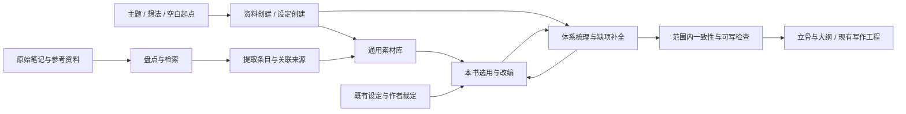

# 通用创作前准备设计

状态：六类工作流程与独立工作区已实现。执行入口为 `skills/ncc-prepare/SKILL.md`，脚本为 `scripts/ncc_prepare.py`。本过程不改变现有书项目的状态与目录契约。

## 要解决的问题

作者可能已经有数百份笔记、设定表、旧稿、参考书摘和自己的目录体系，却还没有 NCC 的书项目。也可能已经写过大纲，但各处设定口径不一致。此时需要先整理资料、补足设定，才能可靠地进入写作。

现有 NCC 从建书进入立书、立骨；素材功能面向简短生活观察，设定功能面向已选类目的建卡与字段校验。缺少从已有资料到本书可用设定的完整处理过程。

目标：作者给出资料、已有设定、主题或想法，NCC 能整理已有内容、补足缺项，也能从空白创造可用的资料与设定。适用于通用资料库、共享世界与具体作品，不绑定某个文件夹、题材或书项目。

## 改造前的断点

| 位置 | 当前行为 | 实际缺口 |
|---|---|---|
| `skills/ncc/SKILL.md` 的定位步骤 | 先定位 NCC 书目录、运行 status | 整理资料没有独立入口，无书时只能开书、拆书或评测 |
| `scripts/ncclib/materials.py` | 必须 load 书项目；仅识别 M/MS 编号卡；内容按单行字段读取 | 既有 Markdown、长表格、分级名录、原始笔记不会成为可处理素材 |
| `scripts/ncclib/settings.py` | 必须 load 书项目；检查固定目录的类目卡 | 不能识别现有设定树，也不能从散落资料建立设定体系 |
| 设定卡与 G1 | 必填字段非空；允许写“待定” | 无法区别下一段剧情必须定的规则与可以后补的远期细节 |
| `scripts/ncclib/memory.py` 的 recall | 检索 NCC 记忆、交接、场景、审稿与台账 | 不是外部资料目录的索引与检索入口 |
| `skills/ncc-new/references/worldbuilding.md` | 告诉 worldbuilder 挑底料、改成适合本书的版本 | 来源登记、改编关系、冲突证据、采用决定与增量更新没有操作闭环 |
| `scripts/ncclib/book.py` 的 migrate | 迁移旧版 NCC schema | 不能当作其他写作工程的导入器；直接 init 会产生另一套目录与状态 |

## 六类任务与三种使用方式

入口为 `/ncc-prepare`；`/ncc` 在书项目定位前识别资料与设定工作并路由至它。

| 对象 | 整理 | 完善 | 创建 |
|---|---|---|---|
| 资料 | 分类、组装内容、保留来源、辨认重复和关联 | 补充缺失信息、查证、更新、补适用条件与例子 | 建立有来源的专题资料，或原创虚构的素材集合 |
| 设定 | 建立体系、实体与关系，理清口径和版本 | 修补因果、边界与冲突，补必要内容 | 从想法构造可运作的世界、体系、人物或其他实体 |

六类都要求实际内容成果；用户可以单独选择、组合执行或全部执行。无资料时创建不受扫描和导入环节阻塞。事实、虚构、推演分别记录，创作不是替事实编来源。

1. **整理通用素材库**：不要求书名、书魂、主角或 book.json。产出可检索、可回查的素材库与待整理清单；通用条目不强制填写“和主角的关系”。
2. **为一本书准备设定**：使用已有故事方向、设定和大纲，建立采用关系、解决影响本书的冲突、补足需要的体系与实体。不重新问作者已经回答过的问题。
3. **检查本轮准备是否完成**：范围可以是通用专题、共享世界、人物群，也可以是开篇、第一单元或某卷。用户需要开始写作时再交给 ncc-new 或 ncc-write，不能据此跳过现有故事与写作闸门。

来源可以是普通目录、Obsidian 资料、外部写作工程或 NCC 书项目。保留原有目录，允许多个资料根。遇到已有权威链、采用决定和状态文件时先识别并沿用。



## 资料、设定与正文的分工

| 对象 | 保存什么 | 成为什么的依据 |
|---|---|---|
| 原始资料 | 原文、原始表格、文件身份、来源定位 | 能回到原文，不因整理而被覆盖 |
| 通用素材 | 事实、名录、机制、灵感、生活细节、写法参考 | 可以被多本书选用，不默认属于任何一本书 |
| 本书候选 | 已挑选的材料、改编建议、可选设定 | 有用途与依据，仍可能被作者否决 |
| 本书正式设定 | 已有裁定或作者确认的规则、实体、关系与例外 | 是本书的口径；采用规则记录到具体条目 |
| 正文 | 角色此刻实际经历与读者可知的内容 | 通过现有场景、知情与写手包流程提供 |

资料库里有某个东西，不等于本书采用了它；本书采用了它，也不等于第一章就该告诉读者。公开资料中的科学事实与小说的虚构规则分开记录。

原始材料的“已整理”与本书的“已采用”是两个维度。一份材料可已整理、可复用，但对某本书禁用。

## 工作过程与交付物

### 盘点已有资料

脚本递归扫描明确指定的资料根，记录相对路径、文件大小、内容 SHA、格式和可读性；先看索引、目录约定与少量代表性样本，再按主题检索。

- Markdown、UTF-8 文本优先支持；表格保持行列关系，长文按标题切片并保留行号。
- PDF、Office 文档、图片与压缩包先列出“需转换/识别”，未读取的文件不标为已处理。转换产物须关联原件。
- 符号链接记录别名与真实路径，防止循环和重复计数；默认不沿链接越过已登记的资料根。
- 文件无法读取、扫描中被改动、链接目标消失时显式报告，不能静默漏掉。
- 按内容哈希找完全重复的文件；相似内容和同名条目只是待比较候选，不自动删除或合并。
- 文件重命名后记录旧位置 missing 与新位置 new；人工结合哈希和内容复核引用，不自动将同内容文件视为同一原件。

交付：资料地图、格式与读取覆盖报告、完全重复组、失效路径候选、尚未分类内容。文件数只是盘点结果，不代表设定完善程度。

### 确定资料身份与采用口径

先读已有目录说明、当前有效的设定和历史裁定，记录其来源。分类建议至少区分现行设定、候选设定、通用素材、旧稿档案、写作方法、正文。

采用规则可精确到文件、章节、表格行或字段。一份通用数值表可能被选用，其中关于主角的某一条规则却已被本书裁定排除。不能只设一个目录级优先级就算完成。

冲突处理记录：双方原文位置、是否同一实体与适用范围、已有有效裁定、会影响什么、推荐处置及理由。已有裁定则按其执行；同一层的互斥内容交作者选择。修改时间较晚不自动取得权威。

书中世界的真实情况、公众说法和角色误解也可能不同。此类差异属于叙事设计，应进入知情关系，不应当成错误统一掉。

### 把资料整理为可复用条目

以实际内容决定粒度：一个人物、一条运行规则、一段完整制度说明、一组等级对照，均可成为条目。分类可随资料增长，不把所有内容塞进生活观察卡。

基本信息：稳定编号、名称、别名、类别、摘要、来源定位、可信性质、关联条目。主题内容保留在 Markdown；索引保存定位和状态，不复制整份原文。

允许的整理动作包括拆分混杂长文、归并确实同义的条目、补索引、统一可确认的命名、保留不同版本、建立上下位与因果关系。对于资料没有明确的内容，区分待查证事实与创作提案。

通用素材字段服务于复用；本书专属字段服务于故事。这两种卡共用来源关联，不强制共用完整模板。

### 从空白创建资料与设定

资料创建可从主题研究问题出发搜集和编写真实资料，也可按用户要求创造虚构名称、民俗、事件或社会机制。借现实规律推演时，事实、假设和原创部分分清；尚未核实的推演不能直接收为事实。

设定创建从用户提供的种子和限制出发，形成基本条件、运作规则、实体与关系，再通过正常、边界和失败情境检验。已有明确方向就直接完成，有关键歧义才给差异明确的方案。通用世界没有主角和大纲也可建设；规模服从用户目标。

资料完善关注内容是否准确、充分且可调用；设定完善关注规则、因果和关系是否能一起成立。两者都需要实际补写，不能用缺项清单代替完善本身。

### 按本书需要完善设定

先建立体系轮廓与关系，再检查其中的实体。仅填写实体卡无法代替系统设计。

| 层面 | 需要澄清的问题 | 常见成果 |
|---|---|---|
| 故事约束 | 题材、主角起点、核心冲突、不能改变的既有决定是什么 | 本书采用边界、已有决定索引 |
| 世界运行 | 时空、地理、社会制度、资源流通和因果链如何相互作用 | 世界结构、地图关系、制度机制 |
| 力量与规则 | 能做什么、不能做什么、条件、代价、上限与例外 | 规则、量纲、等级对照与异常条件 |
| 人物与组织 | 目标、能力、资源、依赖、冲突与关系为何存在 | 人物与势力体系、关系及行动条件 |
| 可调用实体 | 当前故事需要哪些地点、物种、功法、物件、职业等 | 类目与实体卡、命名与别名 |
| 时间与认知 | 事件顺序、谁知道什么、读者什么时候知道 | 时间线、知情与揭示安排 |
| 场景条件 | 下一段剧情里的选择、阻碍与结果有没有必要的依据 | 开篇或单元所需设定、待补资料 |

以上是选题框架，不是所有题材都必须填的百科清单。体系规模随作者目标和故事需求确定。

每个缺项写清：缺什么、何处发现、为什么需要、影响范围、已有可用来源、建议怎么补、谁来定、最晚何时需要。给出有依据的候选或具体补法，不把几十个空字段交回作者。

区分三种补全：

- **从现有材料恢复**：补回散落的信息，保留引用。
- **查证现实知识**：有具体问题才查证，记录出处和不确定性。
- **创作新设定**：提出与本书约束相容的候选，标清推演理由和新增内容；依照用户授权和现有创作决策边界确定采用状态。

设定更改后沿关联检查受影响的角色、数值、时间线、大纲和已写正文；通用素材不随一本书的改编一起被改写。

### 判断准备是否足够

先声明检查范围。结论为“该范围已具备条件”或“仍有具体阻塞”，附尚未解决的项目。

会阻塞目标范围的例子：同一核心规则有两种互斥口径且尚无决定；主角解决冲突依赖尚未说明的能力；关键行程与时间线矛盾；本段需要的数值或事实无依据；明确禁用的旧设定被选入候选材料。

可以保留的待办：暂不上场的远方城市细节、后卷人物的配饰、作者明确允许留待后续探索且不影响当前结果的设定。登记启用条件或需要决定的时间。

不以“写了待定”“文件齐全”“目录里有很多卡”当作可开写依据。也不要求所有远期细节必须在第一章之前完成。

交付：范围、已确定的设定与来源、开放冲突、缺项与决定、下一步动作。语义检查由模型完成；脚本校验记录、引用、源文件是否变化和未关闭的阻塞项，不能宣称静态检查能证明整个世界观自洽。

## 状态与数据设计

资料准备脱离书项目运行。使用独立的准备工作目录保存工作记录，根路径由用户指定或任务工作区解析，不默认在任意外部目录写入文件。

实际结构：

```text
准备工作目录/
  prepare.json              目标、范围、资料根、成果、依赖、采用决定、问题与检查记录
  .ncc-prepare/
    index.json              文件身份、相对路径、SHA、标题与行数、读取结果（生成）
    events.jsonl            变更历史，只追加
    history/                成果版本
    reviews/                有实质内容的语义检查报告
    exports/                按范围生成的交接文档
  成果/                     整理、完善或创建的实际内容
```

源资料原地只读引用；模型形成的交付成果经 item 复制到准备目录并保留内容版本。成果、采用决定、依赖与问题集中在一个准备状态里，正文内容只在成果 Markdown。原工程的目录映射和采用口径保留在交付内容与依据中，不另造竞争的写作状态。

本地来源定位包含：资料根编号、相对路径、SHA、起止行，索引提供标题。外部文献由模型登记可回查书目或地址与定位；脚本不联网验证。源文件变化后引用需复核；与旧内容、采用决定、依赖或问题绑定的完成结论失效，不能以“以前看过”继续采用。

决定记录保留作者原话或既有裁定的出处；不把文件中的任意命令式句子视为新的用户指令。导入状态机仅管理资料处理，不接管外部工程的章进度。

## 脚本接口

以下操作由 `scripts/ncc_prepare.py` 提供，具体参数见 [../skills/ncc-prepare/references/workspace.md](../skills/ncc-prepare/references/workspace.md)。任务与状态词表只在注册表 preparation 中维护。

| 操作 | 作用 |
|---|---|
| init / source | 创建空白准备工作区，按需登记只读来源根或文件 |
| scan | 增量盘点、SHA 与变化检测、重复组和读取覆盖 |
| search / show | 按关键词检索来源，返回位置或完整行段；不自动做语义合并 |
| item | 接收六类任务的完整成果，登记性质、依据、来源、范围、依赖；更新留历史并回到候选 |
| decide | 记录范围内的采用、搁置、排除或候选状态及依据 |
| issue / resolve | 登记缺项、冲突、研究或创建任务，关联成果；关闭依据变化则需复核 |
| review | 保存模型实际完成的语义检查及内容版本依据 |
| status / check | 恢复任务与开放问题；检查指定范围的阻塞和依据是否仍有效 |
| export | 生成通过检查的范围交接；供作者、设定与规划使用，不直接给写手 |

初期优先标准库与本地文件，不引入向量数据库、网络服务或新的第三方状态框架。

## 接入现有 NCC

1. **经理入口**：先识别资料整理意图，再决定是否需要定位 NCC 书项目。准备库的 continue 恢复准备状态；已有书的 continue 保持原行为。
2. **新书入口**：检测作者是否带有现成设定与资料，先读取已有成果再做缺项问答。已有裁定和故事方向不重新生成。
3. **世界设定角色**：承接体系梳理、关系、冲突分析与补全；现实知识交 scholar，人物与大纲各遵守现有分工。是否使用子代理遵循宿主和用户的授权。
4. **素材与类目功能**：生活观察卡继续服务场景质感；准备库服务长资料与体系。选入本书的成果与已有类目、词典、知识台账建立链接，不生成第二套相同事实。
5. **NCC 书项目**：只导出经过采用的条目；数值入知识台账、实体入设定、认知差异入知情关系。对已冻结内容继续走现有变更流程。
6. **外部写作工程**：输出与原目录相适配的整理结果和交接清单；现有追踪文件仍是原工程权威。外部工程转成 NCC 书项目属于显式迁移，不由 prepare 隐式触发。
7. **写手与审稿**：原始资料、候选和完整真相不直接塞入写手包；经已采用设定、场景选择与知情边界进入现有 pack。审稿只获得其任务需要的依据。

## 实现分工

| 批次 | 必须形成的完整能力 | 完成标准 |
|---|---|---|
| 资料接入 | 独立入口、盘点、检索、来源身份、重复与变化报告 | 没有 NCC 书项目也能处理普通资料目录，并说明没读到什么 |
| 整理、完善与创建 | 六类语义方法、体系与关系、采用决定、冲突与缺项闭环 | 实际内容由模型完成；从零创建不依赖源文件，脚本记录依据与结果 |
| 写前交接 | 范围检查、原工程适配、NCC 采用、过期结论失效 | 能把已准备好的范围交给写作，未定或禁用资料不会混入 |

只完成扫描器不能称为完成本能力。只有资料能被整理、冲突和缺项能被持续处理、成果能进入实际写作，才解决作者提出的问题。

脚本首版不直接识别 PDF/图片，不自动判定现实资料真假，不自动合并或搬迁原文件，也不自动把外部工程迁成 NCC 项目。内容转换、查证、语义整理和显式迁移遵循相应宿主能力及用户目标；这些边界在流程中明示。

## 验收情景

- 没有来源文件、书名、主角和大纲时，仍能按主题创建原创资料与设定；不用空模板冒充成果。
- 都市生活、人物关系、科幻技术、共享奇幻世界等目标使用适合自己的结构，不强制统一为修炼题材类目。
- 资料与设定的六类任务可分别执行，并能组合接续；“完善”包含实际补写而非仅列问题。
- 无 book.json 的资料目录包含长文、表格、目录链接和重复文件，能直接开始整理。
- 本书设定、旧稿和通用素材各有相反说法，已有作者裁定被正确识别；未裁定项呈现带来源的选择。
- 复用一张通用表的一部分，同时明确排除其中另一条规则；另一部书仍可采用原表。
- “别名相同但实体不同”与“公众认知不同于真实设定”不会被错误合并。
- 关键字段填写“待定”仍可能阻塞开篇；与开篇无关的远期细节不会强迫作者一次填完。
- 一个主题的关键内容分散在多个文件，能据此恢复完整体系，而非只生成文件清单。
- 找不到依据的新内容保持候选身份；没有作者决定的核心改动不伪装成既定口径。
- 原文改动、资料移动和执行中断后能增量恢复，过期引用与旧的完成结论不会继续有效。
- 外部工程已有追踪状态，准备流程不会创建与之竞争的 book.json，也不会强制搬目录。
- 未支持的格式、链接别名、无法读取的文件进入覆盖报告，不能被当作空资料或处理完成。
- 从准备库交接给写手时，禁用设定、候选真相、审稿判据和无关整库资料不进入写手包。

真实资料验证应在独立输出目录完成，保留输入哈希与本次读取范围；先验证一个有现行设定、旧版来源和待补内容的完整主题，再扩展到整库。私有原文与具体人物设定不进入插件的公共测试夹具。
